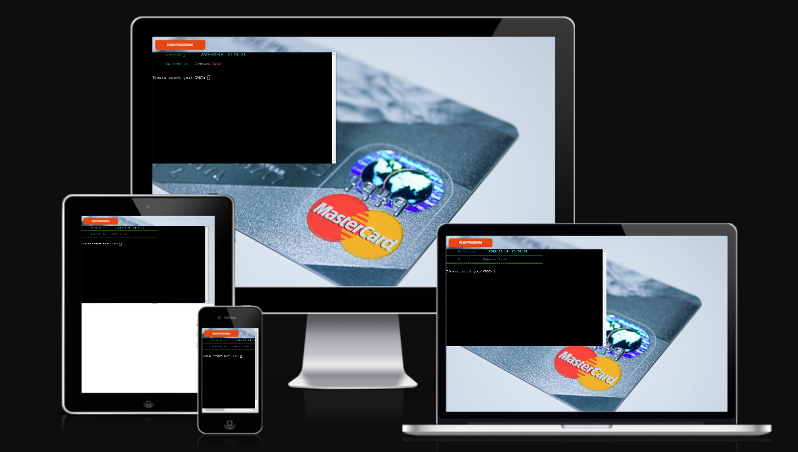

# **ATM Commerz Bank**

## Project Overview

ATM-python is a convenient banking application provided by Commerz bank, enabling clients with debit, credit, or ec cards to access various banking functionalities. This user-friendly app mirrors the traditional ATM experience, offering a range of options including balance inquiry, deposits, withdrawals, PIN changes, PIN display, and exit. Its intuitive design ensures seamless navigation and ease of use for all users.

You can acess the application [ATM Commerz bank](https://atm-python-58b3ab8a62e4.herokuapp.com/)

### My GitHub Repository

You can visit the GitHub Repository [here](https://github.com/alsona1188/atm-python)

## CONTENTS

- [**ATM Commerz Bank**](#atm-python)
  - [CONTENTS](#contents)
  - [User Experience](#user-experience)
  - [Flowchart](#flowchart)  
  - [Features](#features)
    - [Existing Features](#existing-features)
    - [Future Features](#future-features)
  - [Data Model](#data-model)  
  - [Testing](#testing)
  - [Bugs](#bugs)
    - [Resolved Bugs](#resolved-bugs)
    - [Remaining Bugs](#remaining-bugs)
  - [Technologies Used](#technologies-used)
  - [Imported Libraries and Packages Used](#imported-libraries-and-packages-used) 
  - [Heroku Deployment](#heroku-deployment)
  - [Clone the Repository Code Locally](#clone-the-repository-code-locally)
  - [Credits](#credits)
  - [Acknowledgements](#acknowledgements)

  ## User experience
__Target Audience__

  - Commerz Bank Customers: Individual card holders.

  The target users of an ATM commerz Bank project are all the clients who rely on ATMs for their daily banking needs, whether it be for routine transactions,like deposit or withdraws, checking their balance or changin the pin.The project aims to serve these users efficiently and securely, enhancing their overall banking experience.

__User Stories__

As a customer approaching an Automated Teller Machine (ATM), the experience is designed to be user-centric, efficient, and secure. 

The user experience at the ATM is designed to be efficient, secure, and hassle-free.The ATM is user-friendly interface and thoughtful design aim to provide you with a seamless and satisfying banking experience.

## Flowchart
A well-designed flowchart for an ATM software project helps developers, testers, and stakeholders understand the system's functionality, interactions, and decision points, ensuring the smooth operation of the ATM and a positive user experience. The flowchart is given below.

## Features

### Existing Features

### Welcome Screen
- In this ATM machine software project, there is a welcome screen that greets the customer and provides the time and the dat. The welcome screen typically displays a welcoming message and offers the option to insert the card number.

### Validation of Card number and PIN
- If the user enters a wrong card number, than an error message will come informing that the card number is not correct.

- If the user enters a wrong pin, than an error message will come, same as with the card number

- If the user enter 3 times wrong card or pin number than the system will log out and the user will be exiting the atm. 

- If the user enters the correct card number and PIN than a menu will display wit all the functionalities that the ATM is offering. A welcoming message will apear with the name of the customer. 

### Option 1: Balance
 - If the user choose the option 1, than he will be able to see his current balance displayed on the screen.

 - Menu will be displayed after that.

 

### Option 2: Deposit

- if the user is choosing the option 2, deposit, the screen will be cleared and the customer will be asked how much money the user likes to deposit.

 - Here there there are some errors that will display to the user. 
  1. The user must enter a value
  2. The amount should be greater than 0
  3. The value should be numeric. 

- if the user enters a valid amount for deposit, Than it will show the progress bar and also the message that the deposit was successfully updated. When we enter a deposit value than automatically the balance will be updated. 

## Option 3: Withdraw

- if the user is choosing the option 3, withdraw, the screen will be cleared and the customer will be asked how much money the user likes to withdraw.

 - Here there there are some errors that will display to the user. 
  1. The user must enter a value
  2. The amount should be greater than 0
  3. The value should be numeric. 
  4. The amount should be less or equal to the balance

- if the user enters a valid amount for withdraw, Than it will show the progress bar and also the message that the withdraw was successfully updated. When we enter a withdraw value than automatically the balance will be updated. 

## Option 4: Change PIN

- If the want to change the PIN number that he has to enter number 4. There is one condition that the pin should be 4 digit, else error will appear on the screen. 

- When the user enters a valid PIN thank a message will appear that the pin was successfully changed.

## Option 5: Show PIN

- When the user enters number 4, than automatically on the screen will appear the current PIN. 

## Option 6: Exit

- When the user wants to exit the ATM he can just enter option 6. 

### Future Features

- A future feature for this app, is to keep track and save all the deposit and Withdraw of the customer.
- Creating more sheets on the spreadsheet, like withdraw and deposit. 
- Developing the APP not only as an ATM but can go further to Online Banking.

## Data Model

1.Google Sheets:

Google Sheets is used as a data storage and management tool. It allows for organized data storage and retrieval of the user details, like firstname, lastname, Card Number, Pin and Balance.

Here is the link of the spreadsheet:
[atm-python](https://docs.google.com/spreadsheets/d/1LVCX2QFLkQlBhcHl-c_47eY1clq3Ybq8vf8vXKG5wV8/edit?usp=sharing)

     
   
